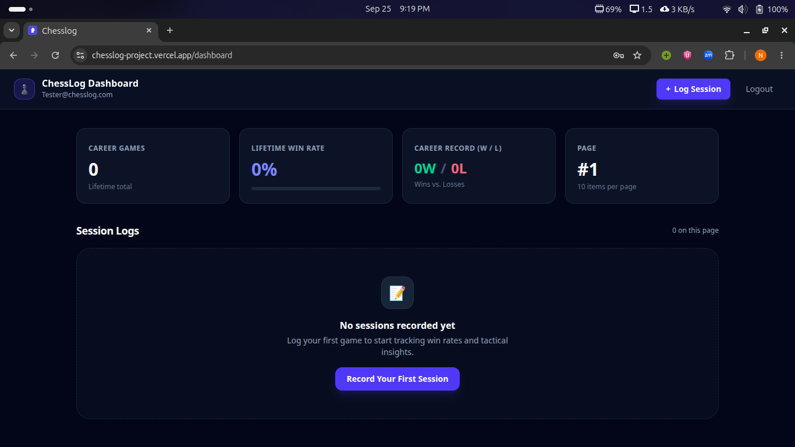

# Chesslog

Chesslog is a basic chess journaling platform to log your wins and losses, and help you improve your overall chess performance.

**Live project link : [Chesslog](https://chesslog-project.vercel.app)**

To start logging your chess games for **FREE** click on the link above and create an account !

---

## The cool features available
- A secure login portal that uses JWT to authenticate your credentials
- Logging your chess games
- Reviewing your chess games and notes with a server side pagination implemented
- Knowing your career win rate
- Adding keywords to your logs 

---

## How to run it locally?

**You need node 24 installed on your computer for this program to work**

After cloning and navigating the github repo, you will need to add a .env file on both the frontend and the backend folders.

- For frontend you'll need to include a 'VITE_API_URL' which in your case would look like "http://localhost:PORT", which is the port you initialized the backend.

- For backend, you'll need to include the following:
NEON - Your postgresql database connection string, in my case I used NEON. You could also use supabase.
PORT - Port number for where the database will initialize
ACCESS_TOKEN - A secure string for creating signatures for the access token on JWT
REFRESH_TOKEN - A secure string for creating signatures for the refresh token on JWT
FRONTEND_URL - where your frontend lives to enable CORS

**Make sure you don't leave any space between the equal to sign(=). 
Example : PORT=8080, not PORT = 8080**

Then you'll need to run the following commands in both frontend and backend folder :
1) npm install 
2) npm run dev 

The website will then be available on localhost with the port you specified.

## How it works

This project implements things like lazy state initialization to avoid disk read with every rerender on the page. I basically used an arrow function inside the useState hook instead of simply reading the accessToken from localStorage. I learned that this helps in the overall performance of the website.

Additionally, I used SQL transactions to insert logs into the database. This allows that logs inputted by the user will always end up being fully added or completely cancelled. This is very important because without using transactions modifying different connected tables may cause errors incase one operation fails. I also implemented a vercel.json file so that vercel doesn't respond with 404 status code when users reload the page. This is one of the major issue I've noticed from my previous project. Since I built a single page application with react-router handling different routes, requesting the dashboard or some route without being inside the page or even reloading the page wouldn't be possible because react needs to rerender the page every time a request is made using javascript rather than sending a new HTML.

---
## Acknowledgment

This project wouldn't have been live without Render, Vercel and Neon. I deployed the backend on Render's free plan, the frontend on vercel and the database on Neon. 

